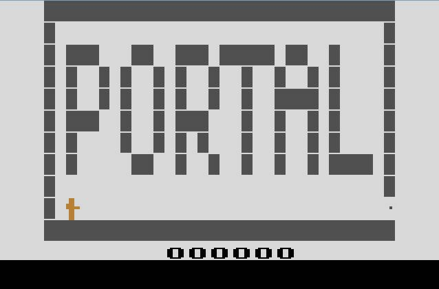
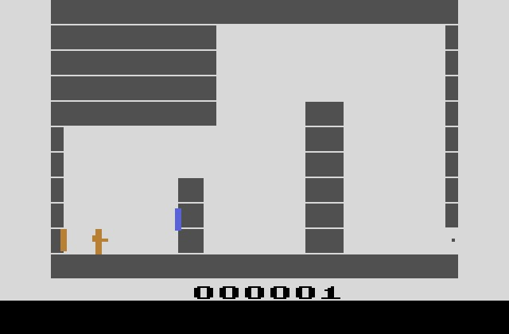

Atari2600-Portal
================

Atari 2600 demake of Valve's Portal video game

Contributors include:
  - Derek Aldrich (Designer)
  - Kirsten Carella (Director)
  - Eli Cooper (Programmer)

Requires install of batari Basic (http://bataribasic.com/) for code compilation and Stella (http://stella.sourceforge.net/) for emulation

---

### Screenshots

###### Title Screen:

###### Level 1:

